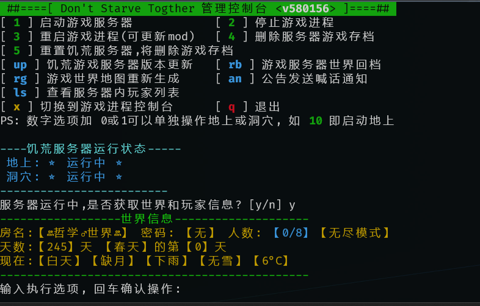

## 搭建饥荒游戏 server

#### SteamCMD Usage

[SteamCMD](https://developer.valvesoftware.com/wiki/SteamCMD)

#### Klei guides

[Klei guide](http://dont-starve-game.wikia.com/wiki/Guides/Don%E2%80%99t_Starve_Together_Dedicated_Servers)

## DST Server 快速搭建

#### 1. 获取本项目代码

- 使用 git 克隆

```shell
git clone git@github.com:qwertyuiop6/DST-Server-Build.git
```

- 或者 使用 https 下载

```shell
sudo apt install unzip -y&&wget https://github.com/qwertyuiop6/DST-Server-Build/archive/master.zip

unzip master.zip&&mv DST-Server-Build-master DST-Server-Build&&rm master.zip
```

#### 2. 赋权并运行

```shell
cd DST-Server-Build&&sudo chmod +x setup.sh&&./setup.sh
```

#### 3. 编辑各项游戏的配置,地图，mod 文件

```
.klei/DoNotStarveTogether/MyDediServer
    -- cluster.ini --游戏服务器配置
    -- cluster_token.txt --klei私人账户token
    -- mods_setup.lua --mod下载列表文件
    -- mods_enable.lua --mod启用与否文件
    -- *.txt  --管理员，黑/白 名单

    /Master
        --server.ini --地上配置
        --worldgenoverride.lua  --地上地图配置
    /Caves
        --server.ini --洞穴配置
        --worldgenoverride.lua  --洞穴地图配置
```

#### 4. 运行 DST Server 日常管理命令: `dst`



按照提示输入选项操作游戏服务器

> 可在数字选项后增加一位数字 0 或 1,单独操作地上或洞穴游戏进程,如　 10: 启动地上

### Other

饥荒游戏服务器[网站/微信号管理](https://github.com/qwertyuiop6/wx-dst-admin)
